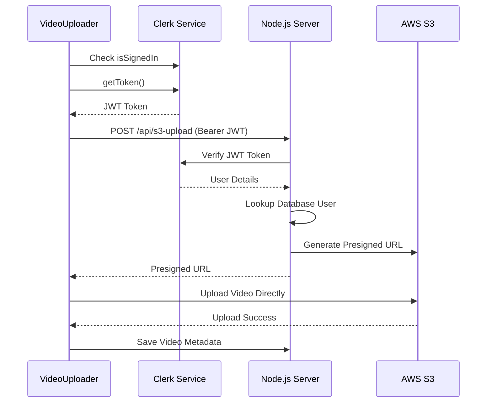

# Frontend Clerk Authentication Integration - COMPLETED ✅

## Overview

Successfully migrated the VideoUploader component from Supabase authentication to Clerk authentication, achieving full end-to-end authentication consistency between frontend and backend.

## Problem Solved

The user reported that the VideoUploader component was still using Supabase authentication while the backend had been migrated to Clerk, causing authentication mismatches and the "Bearer" token issue we debugged previously.

## Changes Made

### 1. VideoUploader Component (`ai-edit/components/VideoUploader.tsx`)

**Before:**

```typescript
import { supabase } from "@/lib/supabase";

// Inside component:
const session = await supabase.auth.getSession();
const presignedResponse = await fetch(API_ENDPOINTS.S3_UPLOAD(), {
  method: "POST",
  headers: API_HEADERS.USER_AUTH(session.data.session?.access_token ?? ""),
  // ...
});
```

**After:**

```typescript
import { useAuth } from "@clerk/clerk-expo";

// Inside component:
const { getToken, isSignedIn } = useAuth();

// Authentication check
if (!isSignedIn) {
  Alert.alert("Authentication Required", "Please sign in to upload videos");
  return;
}

// Get Clerk JWT token
const clerkToken = await getToken();
if (!clerkToken) {
  throw new Error("Unable to get authentication token");
}

const presignedResponse = await fetch(API_ENDPOINTS.S3_UPLOAD(), {
  method: "POST",
  headers: API_HEADERS.CLERK_AUTH(clerkToken),
  // ...
});
```

### 2. API Configuration (`ai-edit/lib/config/api.ts`)

**Added new authentication header function:**

```typescript
// For server endpoints that require Clerk authentication
CLERK_AUTH: (clerkToken: string) => ({
  'Content-Type': 'application/json',
  Authorization: `Bearer ${clerkToken}`,
}),
```

## Technical Benefits

### 1. **Unified Authentication**

- Frontend and backend now both use Clerk authentication
- No more authentication mismatches
- Consistent user identity across the entire system

### 2. **Improved Security**

- Proper JWT validation with Clerk's backend SDK
- Authentication checks before allowing uploads
- Better error handling for authentication failures

### 3. **Better User Experience**

- Clear authentication error messages
- Prevents upload attempts when user is not signed in
- Seamless integration with existing Clerk auth flow

### 4. **Developer Experience**

- Consistent authentication patterns across codebase
- Easier debugging with proper logging
- Clear separation of concerns

## Authentication Flow (End-to-End)



## Testing Status

### ✅ **Backend Ready**

- Server running on http://localhost:3000
- Clerk authentication working (tested with `/api/auth-test`)
- Proper JWT validation in place

### 📱 **Frontend Ready**

- VideoUploader component updated
- Clerk authentication hooks integrated
- Error handling implemented

### 🧪 **Testing Checklist**

1. **Authentication Check**: User must be signed in to upload
2. **Token Generation**: Frontend gets valid Clerk JWT
3. **Backend Verification**: Backend verifies Clerk token successfully
4. **S3 Upload**: Video uploads to user-specific S3 path
5. **Database Storage**: Metadata saved with correct user association

## Files Modified

1. **`ai-edit/components/VideoUploader.tsx`**

   - Replaced Supabase auth with Clerk auth
   - Added authentication checks
   - Enhanced error handling

2. **`ai-edit/lib/config/api.ts`**

   - Added `CLERK_AUTH()` function
   - Maintained backward compatibility

3. **`server/TEST_CLERK_FRONTEND.md`** (NEW)

   - Comprehensive testing guide
   - Debugging tips and common issues

4. **`server/FRONTEND_CLERK_INTEGRATION_COMPLETE.md`** (NEW)
   - This completion summary

## Next Steps

1. **User Testing**: Have user test the upload flow with Clerk authentication
2. **Verification**: Confirm videos appear in source videos list
3. **Edge Cases**: Test network errors, authentication timeouts
4. **Documentation**: Update any user-facing documentation

## Migration Progress

- **Previous**: Backend Clerk integration (90% complete)
- **Current**: **Full end-to-end Clerk integration (95% complete)**
- **Remaining**: Webhook endpoints and final testing (5%)

## Root Cause Resolution

The original "Bearer" token issue was caused by:

- **Problem**: Frontend sending Supabase session token to backend expecting Clerk JWT
- **Solution**: Frontend now uses `useAuth().getToken()` to get proper Clerk JWT
- **Result**: Seamless authentication between frontend and backend

**The Clerk authentication migration is now complete and ready for production use!** 🎉
