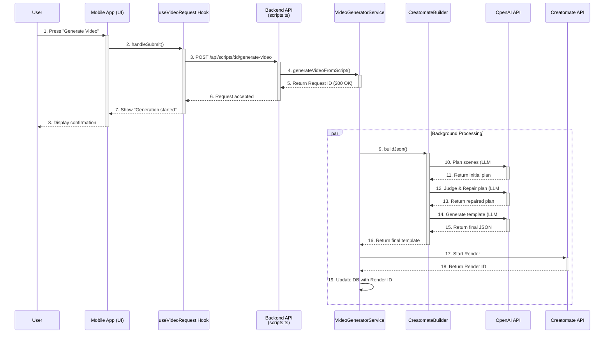

# Video Generation from Script: Pipeline Documentation

This document outlines the complete data and logic flow for the "Generate Video from Script" feature, tracing the process from the mobile app frontend to the backend services and external APIs.

## High-Level Overview

The feature allows a user to select a pre-written script draft, choose source videos, and initiate a video generation process. The backend orchestrates a series of steps, including using multiple AI agents to plan the video structure, repair potential errors, and generate a final render-ready template for the Creatomate API.

---

## Step-by-Step Data Flow

The process can be broken down into two main phases: the **Client-Side Request** (Mobile App) and the **Server-Side Processing** (Backend).

### 1. Client-Side Request (Mobile App)

1.  **UI Interaction (`script-video-settings.tsx`)**:

    - The user is on the "Script Video Settings" screen.
    - They select source videos and configure settings.
    - Pressing the "Generate Video" button triggers the `handleGenerateVideo` function.

2.  **Request Handling (`useVideoRequest.ts`)**:

    - `handleGenerateVideo` calls the `handleSubmit` function from the `useVideoRequest` hook.
    - `handleSubmit` assembles a `requestPayload` containing:
      - The script content (`prompt`).
      - An array of selected video objects (`selectedVideos`).
      - Voice, caption, and editorial profile configurations.
      - The output language.
    - It retrieves a Clerk authentication token.

3.  **API Call (`api.ts`)**:
    - The hook makes a `POST` request to the endpoint defined by `API_ENDPOINTS.SCRIPT_GENERATE_VIDEO(scriptId)`.
    - This resolves to the URL: `[SERVER_BASE_URL]/api/scripts/:id/generate-video`.

### 2. Server-Side Processing (Backend)

1.  **API Route (`routes/api/scripts.ts`)**:

    - The backend router receives the `POST` request.
    - It calls the `generateVideoFromScriptHandler` function.

2.  **Request Handler (`generateVideoFromScriptHandler`)**:

    - Authenticates the user via the Clerk token.
    - Validates the request payload using a Zod schema.
    - Fetches the full script draft from the database to ensure data integrity.
    - Instantiates the `VideoGeneratorService`.
    - Calls `videoGenerator.generateVideoFromScript()`.

3.  **Video Generator Service (`services/video/generator.ts`)**:

    - **`generateVideoFromScript()`**:
      - **Immediate Response**: This method is designed for speed. It first creates a `video_requests` record in the database with a `queued` status.
      - It immediately returns a `200 OK` response to the mobile app, containing the `requestId`.
      - **Background Processing**: It then calls `processVideoFromScriptInBackground()` asynchronously to perform the heavy lifting without making the user wait.
    - **`processVideoFromScriptInBackground()`**:
      - Updates the video request status to `rendering`.
      - Fetches and validates the full data for the selected videos.
      - Instantiates the `VideoUrlRepairer` utility.
      - Calls `generateTemplate()` to start the AI-driven template creation.
    - **`generateTemplate()`**:
      - This method acts as an orchestrator for the `CreatomateBuilder`.
      - It calls `creatomateBuilder.buildJson()`, passing along the script, videos, and configs.

4.  **Creatomate Builder (`services/creatomateBuilder.ts`)**:

    - **`buildJson()`**: This is the core of the AI-powered generation logic.
      1.  **Plan**: Calls `planVideoStructure()`, which makes the **1st LLM call** to create an initial scene-by-scene plan from the script and available videos.
      2.  **Judge & Repair**: The scene plan is passed to `urlRepairer.repairScenePlanWithAI()`. This makes the **2nd LLM call** (the "AI Judge") to validate the plan, correct any incorrect video URLs, and add trim timings based on video analysis data.
      3.  **Generate**: The _repaired_ scene plan is passed to the internal `generateTemplate()` method, which makes the **3rd LLM call** to convert the structured plan into a valid Creatomate JSON template.
      4.  **Finalize**: The builder performs final deterministic fixes and validation on the generated JSON.
      5.  The final, clean template is returned.

5.  **Final Steps (`services/video/generator.ts`)**:
    - Back in `processVideoFromScriptInBackground()`, the final template is received.
    - The service calls `startCreatomateRender()`, which sends the template to the actual Creatomate API to start the video rendering process.
    - The `renderId` from Creatomate is saved to our database, and the video request is marked as complete.

---

## System Diagram

Here is a sequence diagram visualizing the entire process.

