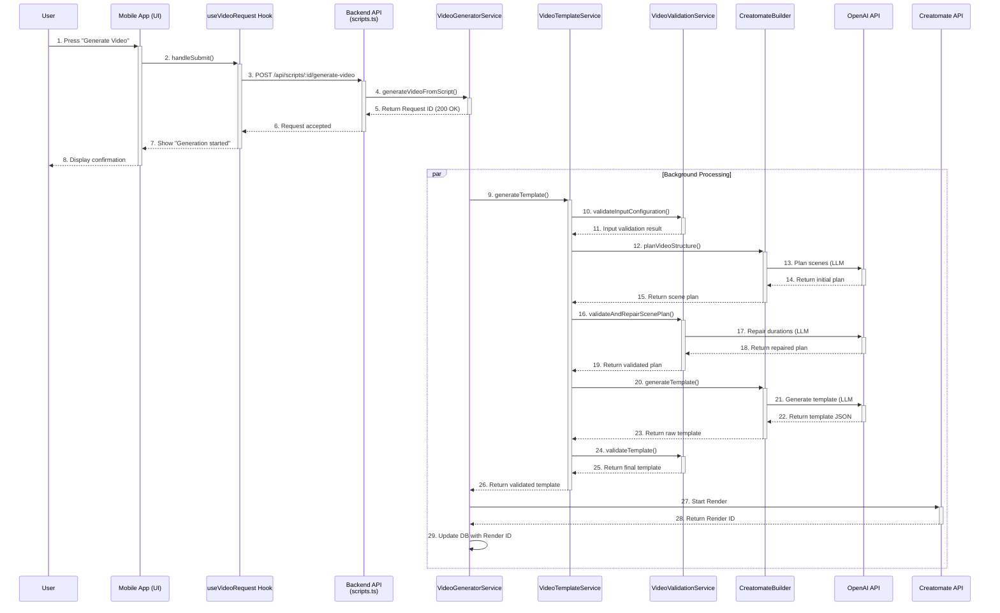

# Video Generation from Script: Pipeline Documentation

This document outlines the complete data and logic flow for the "Generate Video from Script" feature, tracing the process from the mobile app frontend to the backend services and external APIs.

## High-Level Overview

The feature allows a user to select a pre-written script draft, choose source videos, and initiate a video generation process. The backend orchestrates a series of steps, including using multiple AI agents to plan the video structure, repair potential errors, and generate a final render-ready template for the Creatomate API.

---

## Step-by-Step Data Flow

The process can be broken down into two main phases: the **Client-Side Request** (Mobile App) and the **Server-Side Processing** (Backend).

### 1. Client-Side Request (Mobile App)

1.  **UI Interaction (`script-video-settings.tsx`)**:

    - The user is on the "Script Video Settings" screen.
    - They select source videos and configure settings.
    - Pressing the "Generate Video" button triggers the `handleGenerateVideo` function.

2.  **Request Handling (`useVideoRequest.ts`)**:

    - `handleGenerateVideo` calls the `handleSubmit` function from the `useVideoRequest` hook.
    - `handleSubmit` assembles a `requestPayload` containing:
      - The script content (`prompt`).
      - An array of selected video objects (`selectedVideos`).
      - Voice, caption, and editorial profile configurations.
      - The output language.
    - It retrieves a Clerk authentication token.

3.  **API Call (`api.ts`)**:
    - The hook makes a `POST` request to the endpoint defined by `API_ENDPOINTS.SCRIPT_GENERATE_VIDEO(scriptId)`.
    - This resolves to the URL: `[SERVER_BASE_URL]/api/scripts/:id/generate-video`.

### 2. Server-Side Processing (Backend)

1.  **API Route (`routes/api/scripts.ts`)**:

    - The backend router receives the `POST` request.
    - It calls the `generateVideoFromScriptHandler` function.

2.  **Request Handler (`generateVideoFromScriptHandler`)**:

    - Authenticates the user via the Clerk token.
    - Validates the request payload using a Zod schema.
    - Fetches the full script draft from the database to ensure data integrity.
    - Instantiates the `VideoGeneratorService`.
    - Calls `videoGenerator.generateVideoFromScript()`.

3.  **Video Generator Service (`services/video/generator.ts`)**:

    - **`generateVideoFromScript()`**:
      - **Immediate Response**: This method is designed for speed. It first creates a `video_requests` record in the database with a `queued` status.
      - It immediately returns a `200 OK` response to the mobile app, containing the `requestId`.
      - **Background Processing**: It then calls `processVideoFromScriptInBackground()` asynchronously to perform the heavy lifting without making the user wait.
    - **`processVideoFromScriptInBackground()`**:
      - Updates the video request status to `rendering`.
      - Fetches and validates the full data for the selected videos.
      - Calls the **Video Template Service** to orchestrate template generation.

4.  **Video Template Service (`services/video/template-service.ts`)**:

    - **`generateTemplate()`**: This is the new main orchestration method that centralizes the entire template generation flow:
      - **Phase 1**: Calls `videoValidationService.validateInputConfiguration()` to validate script, videos, and caption configuration.
      - **Phase 2**: Uses `CreatomateBuilder.planVideoStructure()` to create an initial scene plan.
      - **Phase 3**: Calls `videoValidationService.validateAndRepairScenePlan()` to validate and repair scene durations and URLs.
      - **Phase 4**: Uses `CreatomateBuilder.generateTemplate()` to create the actual Creatomate JSON.
      - **Phase 5**: Applies template fixes (audio text→source, video fit, captions).
      - **Phase 6**: Calls `videoValidationService.validateTemplate()` for final validation and voice ID fixing.
      - Returns the validated, production-ready template.

5.  **Video Validation Service (`services/video/validation-service.ts`)**:
    
    - **`validateInputConfiguration()`**: Validates script, videos, and configuration before processing.
    - **`validateAndRepairScenePlan()`**: Validates scene durations with AI repair (max 3 attempts) and URL validation.
    - **`validateTemplate()`**: Final template validation with:
      - Template fixes (`patchAudioTextToSource`, `fixTemplate`)
      - Caption configuration handling
      - Structure validation (dimensions, required properties)
      - Voice ID validation and auto-correction
      - URL repair via `VideoUrlRepairer`

6.  **Creatomate Builder (`services/creatomateBuilder.ts`)**:

    - **`planVideoStructure()`**: Makes the **1st LLM call** to create an initial scene-by-scene plan from the script and available videos.
    - **`generateTemplate()`**: Makes the **final LLM call** to convert the structured scene plan into a valid Creatomate JSON template.
    - **Note**: The builder is now focused on pure AI interactions, while validation and repair logic has been moved to the dedicated `VideoValidationService`.

7.  **Final Steps (`services/video/generator.ts`)**:
    - Back in `processVideoFromScriptInBackground()`, the final validated template is received from `VideoTemplateService.generateTemplate()`.
    - The service calls `startCreatomateRender()`, which sends the template to the actual Creatomate API to start the video rendering process.
    - The `renderId` from Creatomate is saved to our database, and the video request is marked as complete.

---

## System Diagram

Here is a sequence diagram visualizing the entire process.

---

## Key Architectural Improvements

### Service Separation & Responsibilities

The pipeline now follows a clear separation of concerns:

**VideoGeneratorService** - Request management & orchestration
- Handles API requests and database operations
- Manages async background processing
- Coordinates the overall generation flow

**VideoTemplateService** - Template generation orchestration
- Main entry point for template generation
- Coordinates between validation and AI services
- Manages the 6-phase generation process

**VideoValidationService** - Validation & repair logic
- Centralized validation for all phases
- AI-powered scene plan repair (max 3 attempts)
- Template structure and voice ID validation

**CreatomateBuilder** - Pure AI interactions
- Focused solely on LLM calls
- Scene planning and template generation
- No validation or repair logic

### Validation & Quality Assurance

The new architecture ensures template quality through multiple validation phases:

1. **Input Validation** - Before any processing
2. **Scene Plan Validation** - With AI-powered repair
3. **Template Validation** - Structure, voice IDs, and final fixes

### Error Handling & Recovery

- **Scene Duration Issues**: Up to 3 AI repair attempts
- **Voice ID Mismatches**: Automatic correction
- **URL Issues**: Automatic repair via VideoUrlRepairer
- **Template Structure**: Validation with detailed error messages

### Testing & Maintainability

The modular architecture enables focused testing:
- **Unit Tests**: Individual service methods (21 tests for ValidationService)
- **Integration Tests**: Service interactions
- **E2E Tests**: Full pipeline validation

This separation makes the codebase more maintainable and allows for targeted testing of critical validation logic.
