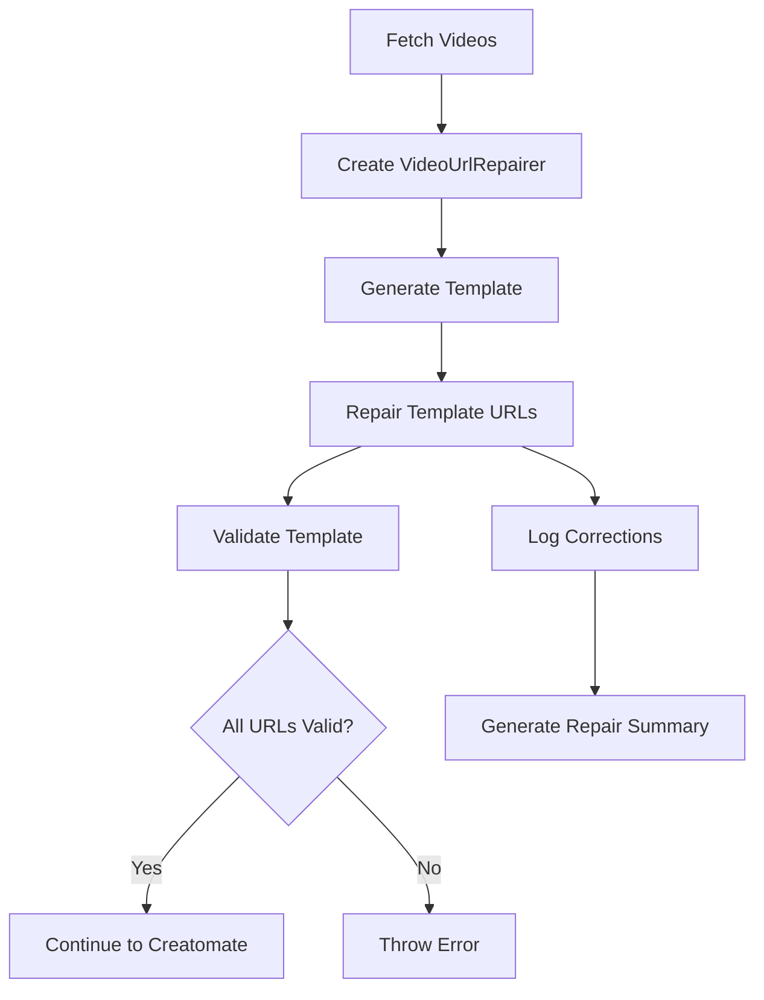

# Video URL Repair System

## 🎯 Problème Résolu

Le système de génération vidéo utilise l'IA pour créer des templates Creatomate. Parfois, l'IA génère des URLs vidéo avec des IDs utilisateur incorrects, causant des erreurs 403 lors du rendu Creatomate.

### Exemple du Bug

- **URL Correcte** : `videos/f3d0be35-d766-4a4a-92bc-ae72614b9470/1751885056638_IMG_0013.MP4`
- **URL Incorrecte** : `videos/f3d0be35-d766-4f7e-ae47-3c1f05d0b5f6/1751885056638_IMG_0013.MP4`

Même fichier, mais ID utilisateur différent → 403 Access Denied.

## 🔧 Solution Implémentée

### 1. Classe VideoUrlRepairer

**Fichier** : `src/services/video/videoUrlRepairer.ts`

**Fonctionnalités** :

- Détecte les URLs incorrectes
- Répare par ID vidéo ou nom de fichier
- Valide les templates finaux
- Journalise toutes les corrections

**Méthodes principales** :

```typescript
// Réparer une URL spécifique
repairUrl(incorrectUrl: string, videoId?: string, step: string): string

// Réparer un plan de scènes
repairScenePlan(scenePlan: any): void

// Réparer un template Creatomate
repairTemplate(template: any): void

// Valider que toutes les URLs sont correctes
validateTemplate(template: any): void
```

### 2. Intégration dans VideoGeneratorService

**Fichier** : `src/services/video/generator.ts`

**Points d'intégration** :

#### A. Dans `processVideoInBackground()`

```typescript
// Après fetchAndValidateVideos
const urlRepairer = new VideoUrlRepairer(videosObj);

// Après generateTemplate
urlRepairer.repairTemplate(template);
urlRepairer.validateTemplate(template);
```

#### B. Dans `processVideoFromScriptInBackground()`

```typescript
// Même logique pour les vidéos générées à partir de scripts existants
```

## 🛠 Stratégies de Réparation

### 1. Réparation par ID Vidéo

- Utilisée quand on a l'ID de la vidéo
- Mapping direct : `videoId → correctUrl`
- **Cas d'usage** : Planification des scènes

### 2. Réparation par Nom de Fichier

- Utilisée quand on n'a que l'URL
- Extraction du nom de fichier : `1751885056638_IMG_0013.MP4`
- Mapping : `filename → correctUrl`
- **Cas d'usage** : Templates Creatomate finaux

### 3. Validation Finale

- Vérifie que toutes les URLs dans le template existent
- Lève une erreur si des URLs invalides sont détectées
- **Garantit** : Pas d'erreurs 403 en production

## 📋 Journalisation et Monitoring

### Logs de Corrections

```typescript
console.warn("🔧 Réparation URL (step):", {
  incorrect: "https://...wrong-id/file.mp4",
  corrected: "https://...correct-id/file.mp4",
  method: "filename",
  videoId: "...",
});
```

### Résumé des Réparations

```json
{
  "totalCorrections": 2,
  "byStep": {
    "generate_template_comp_0_elem_0": 1,
    "plan_structure_scene_1": 1
  },
  "byMethod": {
    "filename": 1,
    "videoId": 1
  }
}
```

## 🔄 Flux de Réparation



## 🚀 Impact

### Avant

- Erreurs 403 aléatoires avec Creatomate
- Vidéos échouent sans raison claire
- Utilisateurs frustrés

### Après

- Réparation automatique des URLs
- Pipeline robuste et fiable
- Logs détaillés pour debugging
- Zero downtime pour l'utilisateur

## 🧪 Tests et Validation

### Tests Unitaires Recommandés

```typescript
// Test 1: URL correcte (pas de réparation)
expect(repairer.repairUrl(correctUrl)).toBe(correctUrl);

// Test 2: URL incorrecte (réparation par filename)
expect(repairer.repairUrl(incorrectUrl)).toBe(correctUrl);

// Test 3: Validation template valide
expect(() => repairer.validateTemplate(validTemplate)).not.toThrow();

// Test 4: Validation template invalide
expect(() => repairer.validateTemplate(invalidTemplate)).toThrow();
```

## 🎯 Points d'Amélioration Future

1. **Métriques** : Ajouter des métriques sur la fréquence des réparations
2. **Cache** : Mettre en cache les mappings filename → URL
3. **Optimisation** : Détecter les patterns d'erreurs pour améliorer les prompts IA
4. **Alertes** : Alerter si trop de réparations sont nécessaires

## 🔧 Configuration

Aucune configuration requise. Le système fonctionne automatiquement dans le pipeline de génération vidéo.

## 📊 Monitoring

Surveillez ces logs pour détecter des problèmes :

- `🔧 Réparation URL` : Réparations effectuées
- `⚠️ Impossible de réparer l'URL` : URLs non réparables
- `📋 URL repairs completed` : Résumés de réparation
- `✅ No URL repairs needed` : Cas où tout fonctionne parfaitement
